# Aarav K. Patel

Computer Science student at the University of Illinois Urbana-Champaign building full-stack systems, applied ML pipelines, and cross-platform apps.

## About

I enjoy turning research and product requirements into software that can be tested, explained, and used. My recent work spans REST APIs and analytics dashboards, iOS/Android modernization, and ML-based quantitative trading research. I am interested in software engineering, applied machine learning, and quantitative or systems-oriented engineering roles.

## Selected projects

### TerraSense

Interactive landslide-hazard intelligence for Mount Rainier. The Next.js/MapLibre frontend combines terrain and hazard layers with a FastAPI backend, LightGBM susceptibility features, forecast rainfall, trail context, and a seven-agent analysis pipeline that produces in-app advisories and route guidance. The current scope is one live mountain, and the production classifier fails closed as `UNCERTAIN` until calibrated artifacts are available.

[Repository](https://github.com/TCYTseven/TerraSense)

<table>
  <tr>
    <td colspan="2"></td>
  </tr>
  <tr>
    <td></td>
    <td></td>
  </tr>
  <tr>
    <td></td>
    <td></td>
  </tr>
</table>

### OpenCane

Native SwiftUI assistive-cane system using iPhone LiDAR, haptic feedback, GPS/MapKit navigation, AirPods spatial audio, Apple Watch cues, and trip evidence. Built with the OpenCane team; the repository’s code name remains CaneKit.

[Repository](https://github.com/aritroBh/OpenCane)

<table>
  <tr>
    <td>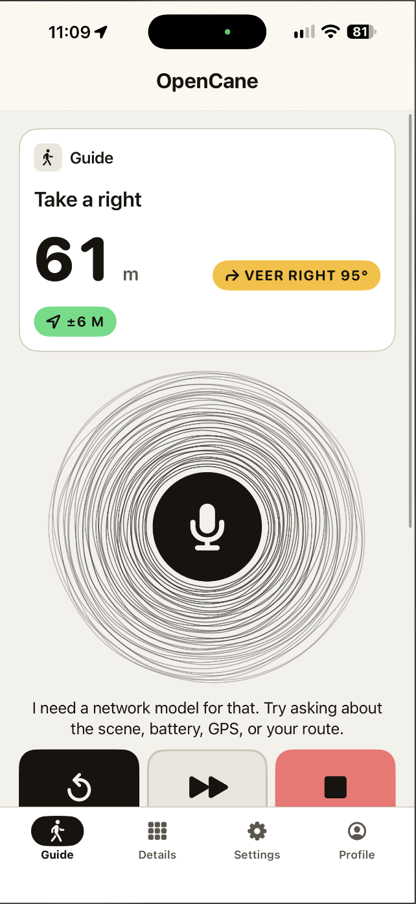</td>
    <td>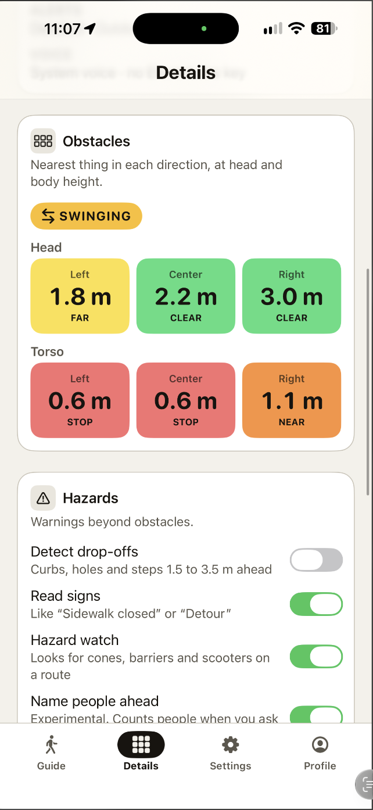</td>
  </tr>
  <tr>
    <td>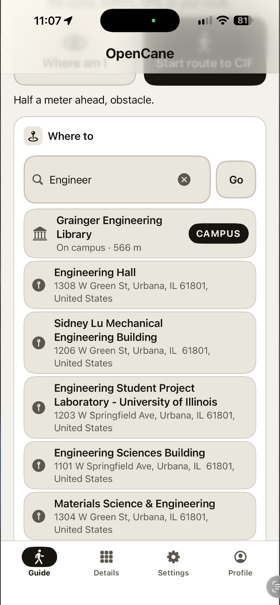</td>
    <td>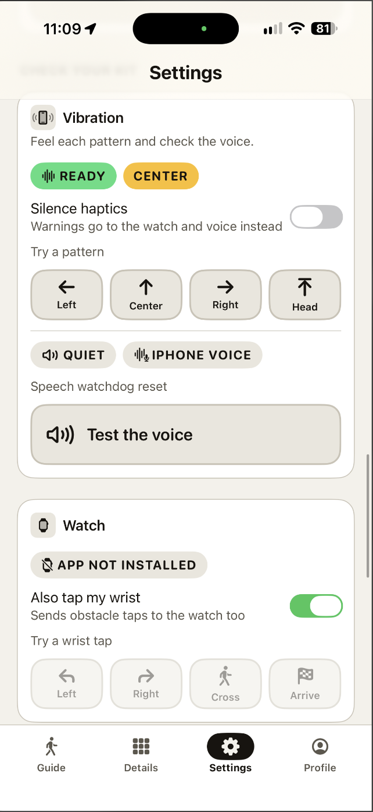</td>
  </tr>
  <tr>
    <td>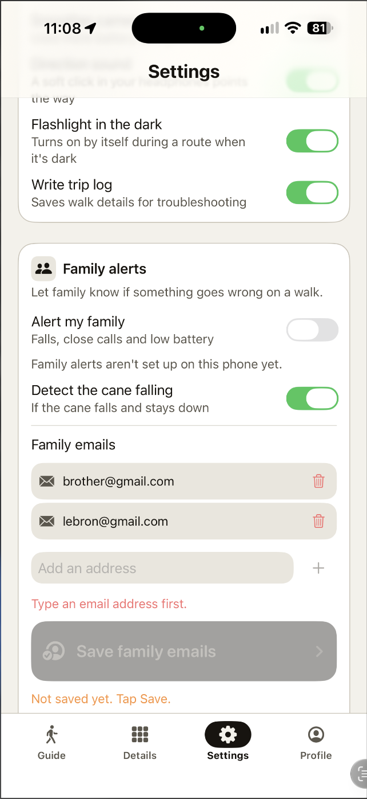</td>
    <td>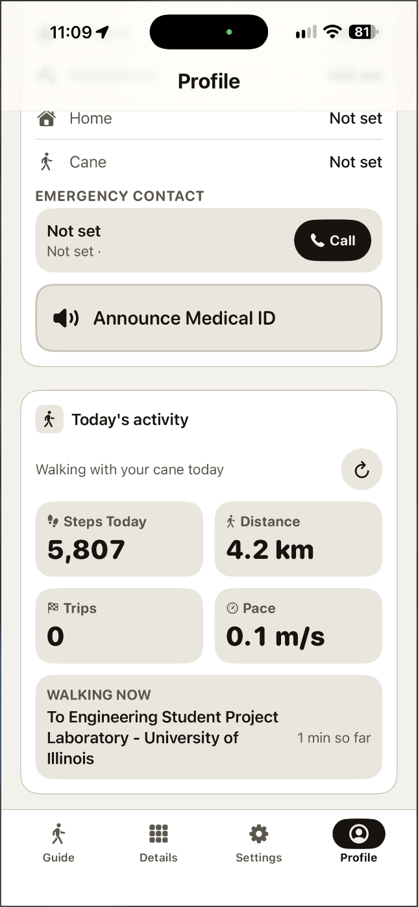</td>
  </tr>
  <tr>
    <td>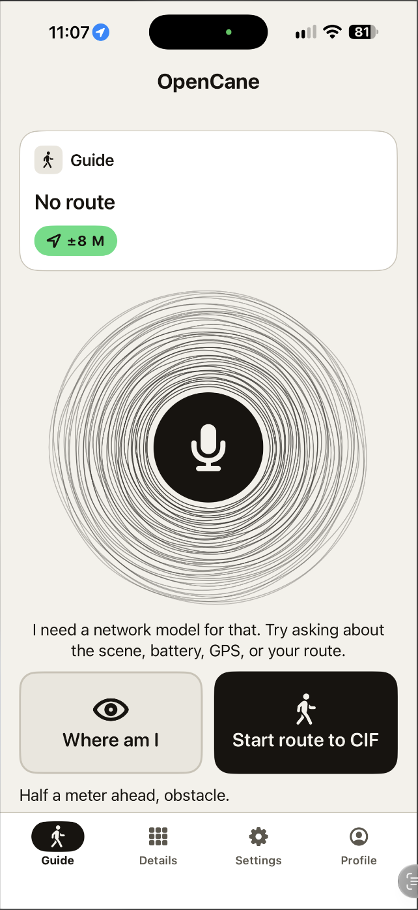</td>
  </tr>
</table>

### QuantEdge Algos

Trading site for strategy overview, cumulative profit and loss from the trade history, and an admin panel for adding trades.

[Repository](https://github.com/AaravPa/QuantEdge)

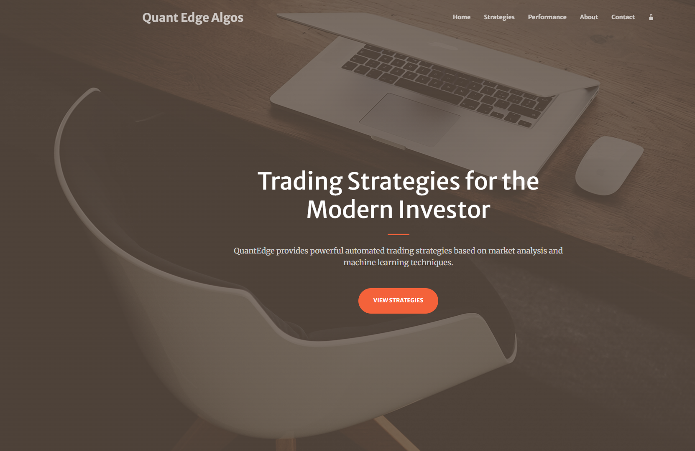

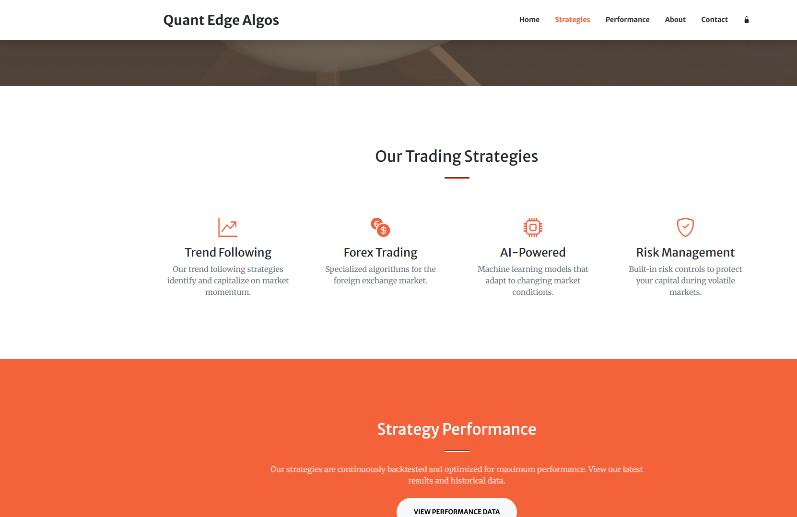

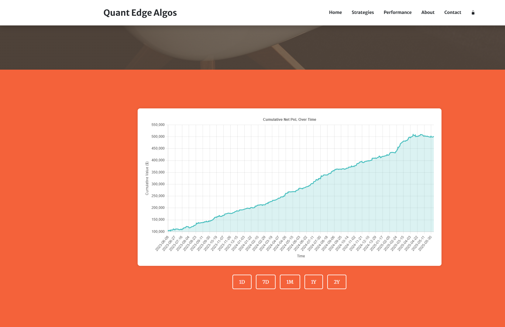

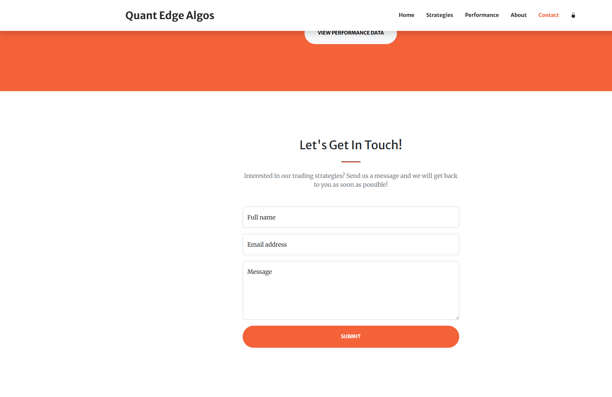

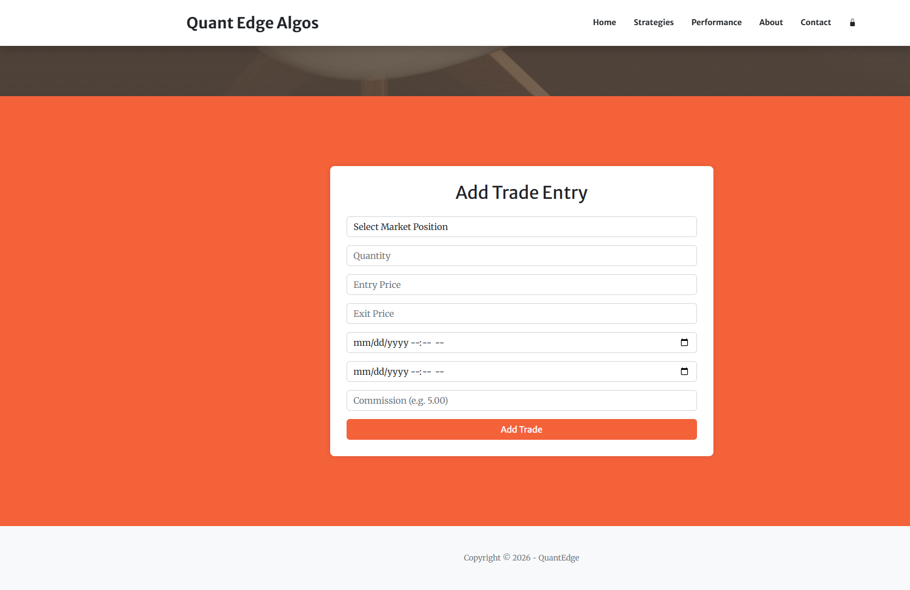

### Data Usage

Local-first data usage monitoring across Android and iOS, with cellular/Wi-Fi plans, history, alerts, widgets, and background refresh. The Android showcase is runnable and stores usage snapshots locally with WorkManager; the complete iOS source is in [DataUsage](https://github.com/AaravPa/DataUsage).

[Android showcase](https://github.com/AaravPa/DataUsage-android-showcase) · [iOS showcase](https://github.com/AaravPa/DataUsage-ios-showcase)

<table>
  <tr>
    <td></td>
    <td></td>
    <td></td>
  </tr>
  <tr>
    <th>Cellular</th>
    <th>Wi-Fi</th>
    <th>History</th>
  </tr>
</table>

### ForHunger

A neighborhood board for surplus food. People post donations, kitchens claim them, and contact details stay private until a claim is accepted. The app is React and Express, with accounts, listings, and claims stored in SQLite.

[Repository](https://github.com/AaravPa/ForHunger)

### Trading Algorithm

Reproducible Python research and paper-trading advisor for META using SMA20/SMA150 signals and out-of-sample walk-forward validation. The repository reports Sharpe 1.08 versus 0.51 for buy-and-hold over its stated test window.

[Repository](https://github.com/AaravPa/Trading-Algorithm)

## Experience highlights

- Modernizing a revenue-generating cross-platform iOS/Android app at **oBytes**, resolving deprecated APIs and outdated dependencies across its core screens.
- Recognized in technology competitions, including 1st Place Overall and 3rd Place in the SpaceX Track at 54FoundersHack 2026.

## Technical stack

- **Languages:** Python, Java, C++, C#, Swift, JavaScript, SQL
- **Application engineering:** Next.js, React, MapLibre GL, ASP.NET Core, FastAPI, REST APIs, React Native, Expo, Firebase, Chart.js
- **ML, data & quant:** LightGBM, pandas, NumPy, scikit-learn, feature engineering, time-series modeling, backtesting, geospatial risk modeling
- **Infrastructure & tools:** Git, Docker, PostgreSQL, Redis

## Contact

- [LinkedIn](https://www.linkedin.com/in/aaravkp/)
- [Email](mailto:patel.aarav@icloud.com)
- [GitHub](https://github.com/AaravPa)
